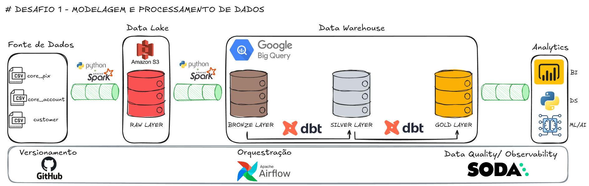

# 🚀 Desafio #1 - Modelagem e Processamento de Dados  

Com os dados disponibilizados, foi construída uma modelagem de pipeline de acordo com o **conceito de camadas Medallion (Raw → Bronze → Silver → Gold)**.  
A solução considera um cenário real de rotina em uma **Fintech**, onde grandes volumes de dados precisam ser processados diariamente com **qualidade, escalabilidade e governança**.  

## 📂 Fontes de Dados  
- **core_pix** (CSV)  
- **core_account** (CSV)  
- **customer** (CSV)  

## ⚙️ Desenvolvimento da Atividade
Esses arquivos foram ingeridos uilizando **Python** (pasta code do projeto) e versionados via **GitHub**. Após a ingestão, eles foram escritos em uma instância do **PostgreSQL** rodando no **Docker** ('docker-compose up' para inciar e 'docker-compose down' para desligar a instância). A partir da camada **raw** realizei as transformações via **queries SQL** para as camadas **bronze**, **silver** e **gold** (pasta sql do projeto).

## 🏗️ Arquitetura da Solução  

## 🔄 Camadas de Processamento  

### 🔴 Raw Layer  
- Ingestão dos arquivos **CSV** em um **Data Lake**.
- No desenho, a título de exemplo, utilizei o **AWS S3**. Para realizar a ingestão e consultas utilizei o **PostgreSQL** rodando no **Docker**.  
- Ingestão dos arquivos sem transformação.  

### 🥉 Bronze Layer  
- Criação das tabelas da camada **bronze**: `core_account`, `core_pix` e `customer`.  
- Os dados foram **copiados da camada raw** e sofreram algumas transformações como **conversão de tipos** e **renomeação de colunas**:  
- O objetivo era criar a camada bronze com dados brutos padronizados, prontos para transformações posteriores.

### 🥈 Silver Layer  
- Criação das tabelas `core_account`, `core_pix` e `customer` com chaves primárias.  
- Deduplicação dos registros.  
- Consolidação dos dados da Bronze garantindo unicidade por chave de negócio.  

### 🥇 Gold Layer  
- Construção de **métricas e cubos analíticos**.  
- Exemplo: volume transacionado via PIX por cliente, número de aberturas de novas contas no mês etc.  
- Dados prontos para **BI (Power BI)**, **Data Science (Python)** e **Machine Learning/AI**.  

## ⚙️ Orquestração e Processamento  
- **Apache Airflow** para orquestração dos pipelines a serem executados.  
- **dbt** para modelagem SQL no data warehouse (Bronze → Silver → Gold).  

## ✅ Data Quality & Observabilidade  
- Uso de **Soda** para monitorar:  
  - **Completude** (colunas não nulas).  
  - **Unicidade** (IDs únicos).  
  - **Conformidade** (tipos e formatos corretos).  
  - **Freshness** (atualização dos dados).  

## 🔐 Governança e Segurança  
- Controle de acessos por **camada (RBAC)** presente nos schemas do DW.  
- Dados sensíveis **tokenizados e mascarados**.
- Logs de auditoria habilitados no **BigQuery**.  

## 📊 Exemplos de Métricas (Camada Gold)
- Total de transações PIX por cliente.  
- Valor médio de transações por tipo de conta.  
- Taxa de crescimento de clientes ativos.  
