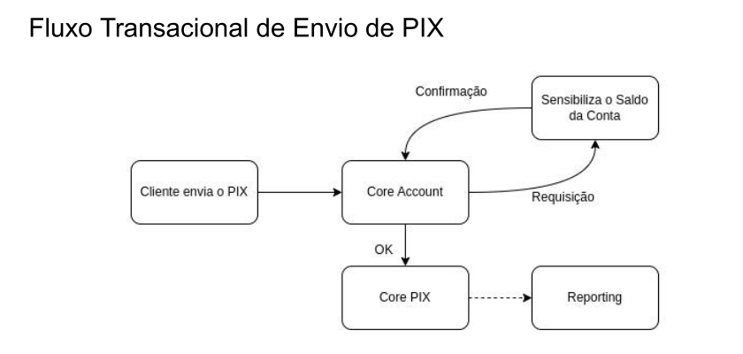
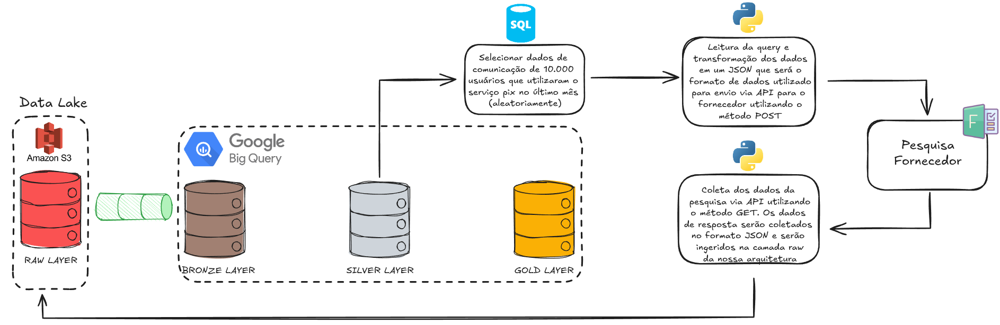

# 🚀 Desafio #1 - Modelagem e Processamento de Dados  

Com os dados disponibilizados, foi construída uma modelagem de pipeline de acordo com o **conceito de camadas Medallion (Raw → Bronze → Silver → Gold)**.  
A solução considera um cenário real de rotina em uma **Fintech**, onde grandes volumes de dados precisam ser processados diariamente com **qualidade, escalabilidade e governança**.  

## 📂 Fontes de Dados  
- **core_pix** (CSV)  
- **core_account** (CSV)  
- **customer** (CSV)  

## ⚙️ Desenvolvimento da Atividade
Esses arquivos foram ingeridos uilizando **Python** (pasta code do projeto) e versionados via **GitHub**. Após a ingestão, eles foram escritos em uma instância do **PostgreSQL** rodando no **Docker** ('docker-compose up' para inciar e 'docker-compose down' para desligar a instância). A partir da camada **raw** realizei as transformações via **queries SQL** para as camadas **bronze**, **silver** e **gold** (pasta sql do projeto).

## 🏗️ Arquitetura da Solução  

## 🔄 Camadas de Processamento  

### 🔴 Raw Layer  
- Ingestão dos arquivos **CSV** em um **Data Lake**.
- No desenho, a título de exemplo, utilizei o **AWS S3**. Para realizar a ingestão e consultas utilizei o **PostgreSQL** rodando no **Docker**.  
- Ingestão dos arquivos sem transformação.
- Códigos utilizados estão presentes na pasta **'code'**.  

### 🥉 Bronze Layer  
- Criação das tabelas da camada **bronze**: `core_account`, `core_pix` e `customer`.  
- Os dados foram **copiados da camada raw** e sofreram algumas transformações como **conversão de tipos** e **renomeação de colunas**:  
- O objetivo era criar a camada bronze com dados brutos padronizados, prontos para transformações posteriores.
- Código utilizado presente no arquivo **'bronze_layer.sql'**.

### 🥈 Silver Layer  
- Criação das tabelas `core_account`, `core_pix` e `customer` com chaves primárias.  
- Deduplicação dos registros.  
- Consolidação dos dados da Bronze garantindo unicidade por chave de negócio.
- Código utilizado presente no arquivo **'silver_layer.sql'**.  

### 🥇 Gold Layer  
- Construção de **métricas e cubos analíticos**.  
- Exemplo: volume transacionado via PIX por cliente, número de aberturas de novas contas no mês etc.  
- Dados prontos para **BI (Power BI)**, **Data Science (Python)** e **Machine Learning/AI**.
- Código utilizado presente no arquivo **'gold_layer.sql'**.  

## ⚙️ Orquestração e Processamento  
- **Apache Airflow** para orquestração dos pipelines a serem executados.  
- **dbt** para modelagem SQL no data warehouse (Bronze → Silver → Gold) e atualização incremental dos dados.  

## ✅ Data Quality & Observabilidade  
- Uso de **Soda** para monitorar:  
  - **Completude** (colunas não nulas).  
  - **Unicidade** (IDs únicos).  
  - **Conformidade** (tipos e formatos corretos).  
  - **Freshness** (atualização dos dados).  

## 🔐 Governança e Segurança  
- Controle de acessos por **camada (RBAC)** presente nos schemas do DW.  
- Dados sensíveis **tokenizados e mascarados**.
- Logs de auditoria habilitados no **BigQuery**.  

## 📊 Exemplos de Métricas (Camada Gold)
- Total de transações PIX por mês.  
- Valor médio de transações por mês.  
- Novos clientes ativos por mês.
- Etc.

# 🚀 Desafio #2 - Visibilidade e Tratamento de Inconsistências no PIX  
Com os dados disponibilizados, optei por fazer 4 tipos de análises que servirão para **validação** do fluxo, **report de problemas** e **inconsistências detectadas** no processo.

- **Transações não registradas no serviço core account** que estão presentes no serviço core pix (core_account.id_transaction is null).
- **Transações não registradas no serviço core pix** que estão presentes no serviço core account (core_pix.id_transaction is null).
- **Transações com valores divergentes** entre os serviços core account e core pix visto que os valores transacionados devem ser o mesmo dentro das duas etapas.
- **Transações com datas de transação divergentes** entre os serviços core account e core pix visto que o serviço deve ser instantâneo.

As consultas utilizadas estão no arquivo **'inconsistencia_pix.sql'**.

# 🚀 Desafio #3 - API Pesquisa de Satisfação com Parceiro
A partir do cenário apresentado, a solução pensada pode ser observada no esquema exemplificado abaixo:

**Roadmap de Desenvolvimento**:

1) **Seleção de clientes** (aleatoriamente) que utilizaram o pix no último mês via consulta SQL na camada silver do nosso banco de dados. 
2) Utilizando um ambiente Python e um conector com o banco, vamos rodar a consulta, gerar um dataframe e, a partir disso, transformarmos os dados desse df em um **JSON que será enviado para o sistema do fornecedor via API** utilizando o método POST da biblioteca requests.
3) O fornecedor, após constatar o recebimento dos dados, será responsável por rodar a **pesquisa de satisfação**. 
4) Depois disso, será gerado um novo script python para **leitura dos dados via API** com o sistema do fornecedor utilizando o método GET da biblioteca requests. **Os dados lidos serão ingeridos na camada raw** no nosso data lake.
5) Criação e **transformação nas camadas bronze, silver e gold** dos dados da pesquisa.
6) **Desenvolvimento de métricas**, visualizações, análises, dashboards + **validação dos produtos** gerados a partir da camada gold.
7) Entegra final do produto **Pesquisa de Satisfação Clientes PIX**.

**Pontos Importantes**:

- Utilizaremos metodologias ágeis para o desenvolvimento, pensando a duração da *sprint* segundo o *cycle time* do time responsável pelo desenvolvimento. Cada etapa do roadmap será quebrada dentro da *sprint* e ao final de cada *sprint* será feita a *review* da *sprint* para análise do andamento do projeto.
- Podemos pensar um template para comunicação com os steakholders sobre o andamento do projeto, seja um e-mail, uma apresentação ou uma mensagem no canal de comunicação oficial da empresa.

